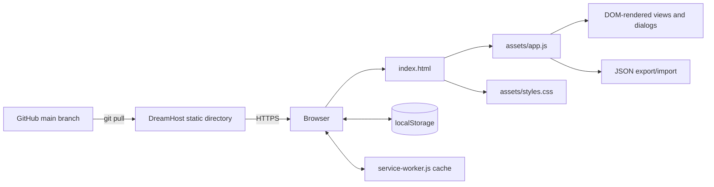
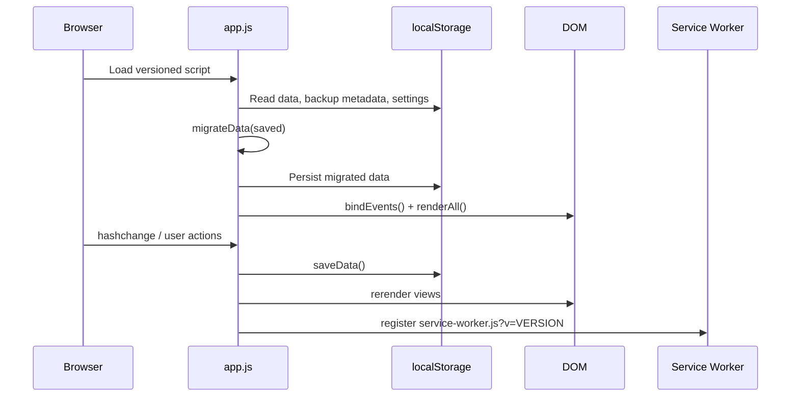

# Fleet OS Technical Specification and Implementation Plan

**Current source version:** 1.3.4
**Architecture:** Static single-page application / progressive web app  
**Runtime dependencies:** None  
**Build system:** None  
**Persistence:** Browser `localStorage`  
**Hosting:** GitHub source → DreamHost static web directory

---

## 1. System overview

Fleet OS is implemented as a no-build browser application composed of one HTML document, one primary JavaScript file, one stylesheet, a web-app manifest, and a service worker.



There is no API, database, server-side code, transpiler, or production framework. A small npm/Playwright development toolchain runs automated tests; the deployed application remains static. All application state is loaded from `localStorage`, migrated in memory, rendered to the DOM, and written back after user changes.

---

## 2. Current repository structure

```text
/
├── index.html
├── manifest.webmanifest
├── service-worker.js
├── README.md
├── CHANGELOG.md
└── assets/
    ├── app.js
    ├── styles.css
    ├── icons/
    │   ├── favicon.svg
    │   ├── icon-192.png
    │   ├── icon-512.png
    │   └── icon-maskable-512.png
    └── images/
        └── yeti-sb140.jpg
```

Current approximate file sizes by lines:

- `index.html`: 345 lines
- `assets/app.js`: 1,874 lines
- `assets/styles.css`: 820 lines
- `service-worker.js`: 44 lines

The architecture is easy to deploy but `app.js` is now a monolith and is the principal maintainability risk.

---

## 3. Runtime lifecycle

1. `index.html` loads versioned CSS and JavaScript query strings.
2. `app.js` injects inline navigation icons.
3. Constants, seed data, geometry metadata, measurement-guide content, and UI options are defined.
4. `loadData()` reads the `fleet-os-v1-data` local-storage key.
5. `migrateData()` merges persisted state into current defaults.
6. The migrated database is immediately written back to local storage.
7. Theme settings and backup metadata are loaded from separate keys.
8. Event handlers are registered.
9. `renderAll()` renders all primary views.
10. Hash routing selects the active view.
11. Initial ride and compatibility recommendations are rendered.
12. The service worker registers with `updateViaCache: 'none'`.



---

## 4. Storage keys

| Key | Purpose |
|---|---|
| `fleet-os-v1-data` | Main application database |
| `fleet-os-backup-meta` | Last backup timestamp and changes-since-backup count |
| `fleet-os-settings` | Theme preference |

### Compatibility requirement

The main key is deliberately still named `fleet-os-v1-data`. Do not rename it without a migration that reads the old key and writes the new one after successful validation.

---

## 5. Root data model

The root database has this conceptual shape:

```ts
interface FleetDatabase {
  version: string;
  owner: string;
  rider: RiderFitBaseline;
  bikes: Bike[];
  wheelsets: Wheelset[];
  parts: Part[];
  maintenance: MaintenanceTask[];
  presets: RidePreset[];
  rideHistory: RideLog[];
  activity: ActivityItem[];
  compatibilityOverrides: Record<string, CompatibilityOverride>; // legacy path
  meta: {
    createdAt: string;
    updatedAt: string;
  };
}
```

All records are plain JSON-compatible objects. IDs are stable strings. Newly created IDs use:

```js
`${prefix}-${Date.now()}-${Math.random().toString(36).slice(2,8)}`
```

This is sufficient for a single-user local app but is not globally collision-proof for distributed sync.

---

## 6. Entity specifications

## 6.1 Rider fit baseline

```ts
interface RiderFitBaseline {
  heightIn?: number;
  weightLb?: number;
  fitSource: string;
  fitDate: string;             // YYYY-MM-DD
  fitBikeId: string;
  baselineCrankLengthMm: number | null;
  saddleHeightMm: number | null;
  saddleSetbackMm: number | null;
  saddleAngleDeg: number | null;
  saddleToBarReachMm: number | null;
  handlebarDropMm: number | null;
  gripReachMm: number | null;
  gripDropMm: number | null;
  bbToGripReachMm: number | null;
  handlebarStackMm: number | null;
  handlebarReachMm: number | null;
  gripWidthMm: number | null;
  gripAngleDeg: number | null;
  assessment: string[];
  notes: string;
}
```

The baseline is stored separately from the corresponding bike’s `fit` object. This duplication is intentional: one object represents the rider’s trusted reference; the bike object represents the currently recorded setup on that bike.

## 6.2 Bike

```ts
interface Bike {
  id: string;
  brand: string;
  model: string;
  year: number | null;
  category: string;
  size: string;
  status: 'active' | 'retired' | 'sold' | string;
  role: string;
  photo: string;

  wheelSize: string;
  axleFront: string;
  axleRear: string;
  freehub: string;
  drivetrainSpeed: number | null;
  drivetrainFamily: string;
  maxCassetteCog: number | null;
  currentWheelsetId: string | null;

  brakes: string;
  brakeFluid: string;
  rotorInterface: string;
  fork: string;
  shock: string;
  weightLb: number | null;

  geometry: BikeGeometry;
  fit: BikeFit;

  purchaseDate: string;
  serialNumber: string;
  geometryNotes: string;
  buildNotes: string;
  notes: string;
}
```

### Bike geometry

```ts
interface BikeGeometry {
  reachMm: number | null;
  stackMm: number | null;
  headAngleDeg: number | null;
  effectiveSeatAngleDeg: number | null;
  topTubeMm: number | null;
  wheelbaseMm: number | null;
  chainstayMm: number | null;
  frontCenterMm: number | null;
  bbDropMm: number | null;
  bbHeightMm: number | null;
  standoverMm: number | null;
  headTubeLengthMm: number | null;
  seatTubeLengthMm: number | null;
  forkTravelMm: number | null;
  sourceLabel: string;
  sourceUrl: string;
}
```

### Bike-specific fit

```ts
interface BikeFit {
  crankLengthMm: number | null;
  saddleHeightMm: number | null;
  saddleSetbackMm: number | null;
  saddleAngleDeg: number | null;
  stemMm: number | null;
  stemAngleDeg: number | null;
  spacerStackMm: number | null;
  handlebarStackMm: number | null;
  handlebarReachMm: number | null;
  saddleToBarReachMm: number | null;
  handlebarDropMm: number | null;
  gripReachMm: number | null;
  gripDropMm: number | null;
  gripWidthMm: number | null;
  notes: string;
}
```

## 6.3 Wheelset

```ts
interface Wheelset {
  id: string;
  name: string;
  category: string;
  role: string;
  wheelSize: string;
  axleFront: string;
  axleRear: string;
  freehub: string;
  rotorInterface: string;
  frontRotorMm: number | null;
  rearRotorMm: number | null;
  cassette: string;
  tires: string;
  pressure: {
    trail: string;
    park: string;
  };
  notes: string;
}
```

## 6.4 Part

All parts share:

```ts
interface PartBase {
  id: string;
  category: string;
  brand: string;
  model: string;
  quantity: number;
  condition: string;
  location: string;
  purchaseDate?: string;
  cost?: number | null;
  notes: string;
  overrides: Record<string, CompatibilityOverride>; // keyed by bike ID
}
```

Category-specific fields include:

| Category | Fields |
|---|---|
| Cassette | `speed`, `freehub`, `minCog`, `maxCog`, `drivetrainFamily` |
| Chain | `speed`, `chainType`, `drivetrainFamily` |
| Brake pads/service/hardware | `brakeSystem`, `fluidType`, `padShape` |
| Rotor | `rotorInterface`, `rotorDiameterMm`, `rotorThicknessMm` |
| Tire | `wheelSize`, `tireWidth`, `casing`, `compound` |
| Other | `standard` |

### Compatibility override

```ts
interface CompatibilityOverride {
  status: 'direct' | 'conditional' | 'emergency' | 'not' | 'unknown';
  reason: string;
  verifiedDate: string;
  method: string;
}
```

## 6.5 Maintenance task

```ts
interface MaintenanceTask {
  id: string;
  bikeId: string;
  title: string;
  priority: 'high' | 'medium' | 'low' | string;
  status: 'open' | 'completed' | string;
  dueDate: string;
  dueLabel: string;
  repeatDays: number;
  cost: number | null;
  notes: string;
  completedDate: string;
}
```

## 6.6 Ride recommendation, preset, and log

```ts
interface RideConfiguration {
  id: string;
  name?: string;
  destination: string;
  type: 'pedal' | 'lift' | string;
  conditions: 'dry' | 'damp' | 'wet' | string;
  priority: 'speed' | 'balanced' | 'grip' | string;
  mileage: number;
  technical: 'smooth' | 'mixed' | 'technical' | string;
  bikeId: string;
  wheelId: string;
  pressure: string;
  suspension: string;
  gear?: string;
  createdAt?: string;
}
```

Ride logs add user-entered fields such as `date`, `rating`, `actualPressure`, and `notes`.

## 6.7 Activity

```ts
interface ActivityItem {
  id: string;
  at: string;   // ISO timestamp
  text: string;
}
```

The application retains the newest 50 activity records.

---

## 7. Migration behavior

`migrateData(raw)` performs a permissive merge:

- Invalid or non-object input returns a cloned seed database.
- Root seed defaults are overlaid with persisted root fields.
- Rider defaults are merged with saved rider values.
- Each saved bike merges matching seed defaults by `id`.
- Nested `geometry` and `fit` objects are merged separately.
- Wheelsets receive pressure defaults.
- Parts receive quantity, condition, location, and override defaults.
- Maintenance receives newer schedule/history defaults.
- Missing arrays fall back to seed arrays.
- The database version is always rewritten to `APP_VERSION`.
- A one-time correction changes a v1.0 baseline saddle angle from `-1` to `+1` when the fit source matches the seed source.

### Migration concerns

- The migration is not schema-validated.
- Seed values can silently fill new fields on existing records with matching IDs.
- A malformed but parseable object can produce unexpected types.
- There is no migration version registry or transactional rollback.
- The app writes migrated data immediately after load.

A future migration layer should validate first, retain a pre-migration snapshot, and execute explicit version-to-version transforms.

---

## 8. Routing

Fleet OS uses URL hashes.

| Route | View |
|---|---|
| `#/home` | Dashboard |
| `#/fleet/bikes` | Bike list |
| `#/fleet/wheels` | Wheelsets |
| `#/fleet/geometry` | Geometry & Fit |
| `#/bike/:id` | Bike detail |
| `#/wheel/:id` | Wheelset detail |
| `#/workshop/inventory` | Spare inventory |
| `#/workshop/compatibility` | Compatibility engine |
| `#/workshop/maintenance` | Maintenance |
| `#/ride` | Ride configurator |
| `#/more` | Backup, appearance, privacy, reset |

`renderRoute()` toggles `.view` elements, updates primary navigation state, applies subview tabs, renders detail pages, updates document title, and scrolls to the top.

---

## 9. Rendering and state management

Global mutable state is stored in the `state` object:

```ts
interface UIState {
  data: FleetDatabase;
  route: string;
  fleetTab: string;
  workshopTab: string;
  geometryBikeIds: string[];
  geometryReferenceId: string;
  fitTargetId: string;
  measurementGuideId: string;
  editor: unknown;
  currentRecommendation: RideConfiguration | null;
  importCandidate: unknown;
  confirmAction: (() => void) | null;
}
```

`saveData()`:

1. Optionally adds an activity item.
2. Updates database version and timestamp.
3. Writes the full database to local storage.
4. Increments changes-since-backup.
5. Calls `renderAll()`.
6. Shows a toast.

This full rerender is acceptable for the current data size but couples all views and increases regression risk.

---

## 10. Generic editor system

One `<dialog>` is reused for:

- Bike
- Rider fit baseline
- Wheelset
- Part
- Maintenance task
- Ride preset
- Ride log

`editorSections(type, record)` returns declarative groups of field descriptors. `renderField()` converts descriptors to HTML. `saveEditor()` performs type-specific conversion and persistence.

Benefits:

- Low duplication
- Easy addition of fields
- Consistent dialog layout

Limitations:

- No formal validation schema
- Numeric coercion can produce `NaN` for unexpected values
- Conditional part fields require manual rerender logic
- Large bike editor is difficult to scan
- Editor model and persistent model are coupled through flatten/unflatten functions

---

## 11. Geometry engine

`GEOMETRY_METRICS` defines label, unit, and decimals for 14 values.

### Comparison behavior

- Select up to three non-sold bikes.
- Select a reference among the chosen bikes.
- Show quick deltas for reach, stack, wheelbase, and head angle.
- Plot bikes with known reach and stack on a responsive inline SVG.
- Show a matrix of absolute values and deltas.
- Store and render sanitized source URLs.

### Handling interpretations

Current thresholds:

| Metric | Considered nearly equal when |
|---|---|
| Reach | absolute delta < 5 mm |
| Stack | absolute delta < 5 mm |
| Head angle | absolute delta < 0.4° |
| Wheelbase | absolute delta < 10 mm |
| Effective seat angle | absolute delta < 0.5° |

The language is heuristic and should remain educational, not deterministic.

Cross-category comparisons prepend a warning that frame geometry does not define equivalent cockpit fit across bar types and disciplines.

---

## 12. Fit advisor

### Crank-adjusted saddle-height estimate

The current formula is:

```text
target saddle height =
  baseline saddle height
  + baseline crank length
  - target crank length
```

Equivalent JavaScript:

```js
const target = rider.saddleHeightMm
  + (rider.baselineCrankLengthMm - fit.crankLengthMm);
```

This preserves a similar maximum leg-extension relationship at the bottom of the stroke. It is intentionally labeled medium confidence because saddle shape, pedals, shoes, category, suspension, and rider response can justify a different result.

### Road/gravel behavior

When target handlebar stack and reach are known:

- Compute target-minus-baseline stack delta.
- Compute target-minus-baseline reach delta.
- Warn when target stack is more than 10 mm lower.
- Warn when target reach is more than 10 mm longer.

When target saddle setback is known, compare it to the baseline but warn that saddle shape affects tip-based measurements.

### Mountain-bike behavior

- Do not compare the road handlebar target as a required MTB position.
- Treat recorded MTB bar coordinates as that bike’s own baseline.
- Use mobility context to discourage aggressive front-end lowering.
- Provide bike-specific starting-focus text for seeded bike IDs.

### Safety language

Every fit flow should preserve:

- Starting-point framing
- Confidence labels
- One-variable-at-a-time protocol
- Record-before-changing instruction
- Stop/reassess instruction for pain, numbness, asymmetry, or control loss

---

## 13. Measurement-guide system

`MEASUREMENT_GUIDES` is a static array. Each guide contains:

```ts
interface MeasurementGuide {
  id: string;
  label: string;
  group: 'Fit' | 'Geometry' | string;
  fieldLabel: string;
  diagram: string;
  purpose: string;
  definition: string;
  measureFrom: string;
  measureTo: string;
  howTo: string[];
  tips: string[];
}
```

The selector groups records by `group`. `measurementGuideDiagram()` maps the `diagram` key to inline SVG output.

Two base illustrations exist:

- Side-view bicycle for most geometry and fit measurements
- Front-view handlebar/wheel representation for grip width

### Known design state

The illustration was iterated several times after versions 1.3.2 and earlier were rejected as insufficiently realistic. The product owner accepted the v1.3.4 generic bicycle direction. Preserve its named measurement anchors and cover future artwork changes with automated geometry checks and manual desktop/mobile review.

### Technical recommendation

Move diagram geometry into a dedicated module or static SVG assets with named anchor points. The current template-string SVG is hard to preview, test, and maintain inside the monolithic JavaScript file.

---

## 14. Compatibility engine

### Status model

- `direct`
- `conditional`
- `emergency`
- `not`
- `unknown`

### Resolution order

1. If a manual part override exists for the selected bike, return it.
2. Otherwise run category-specific criteria.
3. If any criterion is `not`, overall status is `not`.
4. If all criteria are `direct`, overall status is `direct` unless category rules intentionally downgrade it.
5. If any criterion is `conditional`, overall status is `conditional`.
6. Otherwise overall status is `unknown`.

### Chain rules

- Speed must match or result is incompatible.
- Drivetrain family is direct, conditional, or unknown.
- Required chain length always requires physical sizing.
- A speed match with unresolved fields becomes conditional, not direct.

### Cassette rules

- Speed must match.
- Freehub must match.
- Largest cog must not exceed documented derailleur capacity.
- Chain/cassette generation remains unresolved.
- Matching speed and freehub still results in conditional when other criteria are unresolved.

### Tire rules

- Wheel size must match.
- Frame/fork clearance remains unknown.
- Casing and compound suitability are conditional.

### Rotor rules

- Hub interface must match.
- Diameter/adapter requirements remain unknown.
- Thickness/caliper support remains unknown.

### Brake consumable/service rules

- A brand token from `brakeSystem` is matched against the bike’s brake description.
- Fluid type must match.
- Exact pad shape or hardware family remains conditional/unknown.

### Wheelset rules

- Wheel size
- Front axle
- Rear axle
- Freehub
- Rotor interface/offset
- Tire clearance

Wheelsets are always downgraded from automatic direct to conditional because cassette, rotor, caliper, and clearance checks remain.

### Manual verification limitation

Manual overrides are currently saved only on part records. Wheelset overrides are not supported; the UI advises editing wheel standards or notes. This should be corrected in a future schema.

---

## 15. Maintenance engine

Completing a task:

- Sets status to completed.
- Records today as `completedDate`.
- If `repeatDays > 0`, clones the task into a new open record with a new ID and due date calculated from today.

Reopening clears `completedDate`.

Potential future issue: recurrence is based on completion date only and supports days, not months, ride hours, mileage, or last-service counters.

---

## 16. Ride recommendation engine

The current ride engine is personal and rule-based, not general-purpose.

### Input

- Destination
- Ride type
- Conditions
- Priority
- Mileage
- Technical level

### Current selection logic

- Lift-served or named bike-park destinations default to the seeded trail bike.
- Other rides default to the seeded XC bike.
- Short technical or grip-priority rides can switch to the trail bike.
- Dry, speed-priority, non-park rides select the seeded XC wheelset.
- Wet, damp, grip, park, or technical rides select the seeded aggressive wheelset.
- Otherwise use the balanced wheelset.

Pressure comes from the selected wheelset’s trail or park preset. Suspension and packing text are selected by bike and park status.

### Technical risk

The algorithm depends on hard-coded record IDs such as `blur`, `sb140`, `hunt`, `raceface`, and `synthesis`. Deleting or renaming those seed IDs can break recommendation generation. A future implementation should store editable decision rules or role tags rather than fixed IDs.

---

## 17. Backup and import

### Export

- Serializes the entire database with two-space indentation.
- Downloads `fleet-os-backup-YYYY-MM-DD.json`.
- Updates backup metadata and resets changes-since-backup.

### Replace import

- Migrates the imported object and replaces the current database.

### Merge import

- Merges array records by ID.
- Existing local IDs win.
- Imported records with matching IDs are ignored, even if newer or more complete.
- Rider/root scalar fields are not merged in merge mode.

This behavior should be clearly documented or replaced with field-aware conflict resolution.

---

## 18. Service worker and caching

### Current strategy

- Cache name includes the application version.
- App-shell asset URLs include version query strings.
- Install pre-caches the shell and calls `skipWaiting()`.
- Activate deletes older cache names and calls `clients.claim()`.
- Navigation requests use network with cached `index.html` fallback.
- Other GET requests use network first, cache successful same-origin responses, and fall back to cache.
- Registration uses `updateViaCache: 'none'`.
- An update banner appears when an updated worker is installed while an existing controller is active.

### Release requirement

A version bump must update all of the following:

1. `APP_VERSION` in `assets/app.js`
2. CSS query string in `index.html`
3. JS query string in `index.html`
4. Footer version in `index.html`
5. Service-worker registration query string in `assets/app.js`
6. `CACHE_NAME` in `service-worker.js`
7. Versioned URLs in `APP_SHELL`
8. README and changelog references

This duplication is error-prone and should be automated.

---

## 19. Security and privacy

### Current posture

- No authentication
- No server database
- No network submission of user records
- User edits are confined to browser storage
- Public static application and seed data are visible in GitHub and on the hosted site
- Source links are restricted to HTTP/HTTPS before rendering
- Text inserted into generated HTML is escaped by `esc()` in most rendering paths

### Risks

- Anyone with access to the browser profile can read local data.
- Exported JSON is unencrypted.
- Public seed data contains personal fit context.
- Direct HTML template generation requires discipline to avoid missed escaping.
- No Content Security Policy is currently documented.

### Future recommendations

- Separate public demo seed data from private user data.
- Add schema validation to imports.
- Add a CSP compatible with static hosting.
- If cloud sync is introduced, use authentication, encryption in transit, least-privilege APIs, and explicit privacy controls.

---

## 20. Accessibility and responsive behavior

Current implementation includes:

- Skip link
- Semantic headings and labels
- `aria-current` navigation state
- Dialogs
- `aria-live` for toasts, fit result, and ride result
- Visible `:focus-visible` outlines
- Reduced-motion handling
- Desktop sidebar and mobile bottom navigation
- Responsive breakpoints at 1100, 900, 820, and 520 px
- Print-specific styles

Automated and manual accessibility testing has not been established. Add keyboard, focus-trap, contrast, zoom, and screen-reader smoke tests.

---

## 21. Known technical debt and defects

### P0 / release risk

- No automated test suite.
- `app.js` and `styles.css` are monolithic.
- Version strings are duplicated across files.
- Service-worker regressions have already caused production navigation failures.
- The latest measurement illustration has not been visually accepted.

### P1 / data integrity and consistency

- No schema validation for local or imported data.
- Migrations are permissive and immediately persisted.
- Merge import ignores updates to existing IDs.
- Manual wheelset compatibility overrides are unsupported.
- Legacy top-level `compatibilityOverrides` coexists with `part.overrides`.
- Bikes, wheelsets, and parts have no delete/archive action in the current UI beyond bike status.
- New record IDs are not suitable for future distributed sync.

### P1 / stale copy and documentation

- Reset copy still says it restores the “v1.2 sample database.”
- A wheelset override message still refers to “v1.1.”
- README release summary and commit example have drifted from the latest illustration release.
- Some seed descriptions may no longer reflect the physical fleet.

### P2 / architecture

- Full rerender after every save.
- Direct DOM lookups assume all elements exist.
- Hard-coded seed IDs drive ride recommendations and some fit text.
- Inline SVG is difficult to edit visually.
- No module boundaries, type checking, linting, or formatter configuration.
- No error boundary or user-facing recovery for rendering exceptions.

---

## 22. Testing strategy

## 22.1 Immediate smoke suite

Use Playwright or an equivalent browser runner against a local static server.

Required tests:

1. App loads with no console errors.
2. All five primary routes open.
3. Fleet tabs open, including Geometry & Fit.
4. Measurement selector renders every guide without exception.
5. Add/edit bike persists after reload.
6. Geometry values and fit values survive reload.
7. Compatibility result renders for a part and a wheelset.
8. Manual part verification persists.
9. Maintenance completion and recurrence work.
10. Ride recommendation, preset, and log work.
11. Export produces valid JSON.
12. Replace import restores data.
13. Migration from a v1.1-style fixture preserves existing records.
14. Service worker registers and update banner behavior is testable.
15. Mobile viewport has no horizontal overflow.

## 22.2 Unit tests after modularization

- `migrateData`
- Compatibility criteria and summaries
- Geometry delta formatting
- Fit saddle-height calculation
- Ride rule selection
- Import merge/conflict logic
- Date recurrence logic
- URL sanitization

## 22.3 Visual regression

Capture desktop and mobile screenshots for:

- Dashboard
- Bike detail
- Geometry comparison
- Every measurement diagram or representative side/front diagrams
- Compatibility result
- Maintenance list
- Ride setup
- Dialogs in light and dark mode

## 22.4 Manual release checks

- Safari normal window
- Safari private window
- Chrome/Chromium
- Installed PWA/offline
- Keyboard-only navigation
- Backup before clearing website data

---

## 23. Recommended architecture evolution

A no-framework refactor can preserve simple deployment while creating modules:

```text
/
├── index.html
├── src/
│   ├── main.js
│   ├── config/version.js
│   ├── data/
│   │   ├── seed.js
│   │   ├── schema.js
│   │   ├── storage.js
│   │   └── migrations.js
│   ├── domain/
│   │   ├── compatibility.js
│   │   ├── geometry.js
│   │   ├── fit.js
│   │   ├── maintenance.js
│   │   └── ride.js
│   ├── ui/
│   │   ├── router.js
│   │   ├── render.js
│   │   ├── editor.js
│   │   ├── dialogs.js
│   │   └── measurement-diagrams.js
│   └── styles/
│       ├── tokens.css
│       ├── base.css
│       ├── components.css
│       └── responsive.css
├── tests/
│   ├── unit/
│   ├── fixtures/
│   └── e2e/
├── scripts/
│   └── release.mjs
├── manifest.webmanifest
├── service-worker.js
└── package.json
```

An ES-module browser build can still remain dependency-light. A small Node toolchain can be used for tests, formatting, schema generation, and release versioning without requiring a complex production build.

---

## 24. Implementation plan

## Phase 0 — Baseline and release hygiene

**Objective:** Make current behavior reproducible before new functionality.

- Verify repository, production, and source snapshot versions.
- Commit the product documents into `/docs`.
- Add `package.json` with scripts for local server, tests, and formatting.
- Add Playwright smoke tests.
- Fix stale version copy and README commit instructions.
- Add a release script that updates version constants and query strings.
- Save representative JSON fixtures from v1.0/v1.1/v1.2/v1.3.

**Exit criteria:** A release can be tested and versioned consistently with one command.

## Phase 1 — Data safety

**Objective:** Protect the user database before architectural changes.

- Define a JSON schema or Zod schema.
- Validate imported and persisted data.
- Add a migration registry keyed by source version.
- Store a pre-migration recovery copy.
- Improve merge import to offer conflict choices or newer-field merging.
- Consolidate compatibility overrides into one model.
- Add export/import regression tests.

**Exit criteria:** Invalid data cannot silently replace valid data, and migrations are test-covered.

## Phase 2 — Modularization

**Objective:** Reduce change risk without changing product behavior.

- Extract pure domain functions first.
- Extract storage and migrations.
- Extract router and editor helpers.
- Extract measurement guide content and SVG diagrams.
- Split CSS by responsibility.
- Keep DOM IDs and routes stable during the refactor.

**Exit criteria:** Core calculations are unit-tested and no single source file remains a cross-domain monolith.

## Phase 3 — Geometry and fit quality

**Objective:** Complete the feature that is currently under active design review.

- Preserve the accepted v1.3.4 illustration geometry.
- Decide generic versus category-specific bike diagrams.
- Store diagram anchors separately from rendered paths.
- Add measurement history and before/after notes.
- Add explicit saddle model, pedal/shoe stack, bar rise, sweep, and suspension-state fields if needed.
- Add a fit-completeness checklist.
- Improve geometry insights with documented thresholds and tests.

**Exit criteria:** Measurement visuals are approved, reproducible, and covered by visual regression tests.

## Phase 4 — Product completeness

**Objective:** Close gaps in the current management workflows.

- Add archive/delete flows for bikes, wheels, and parts with dependency checks.
- Add wheelset manual overrides.
- Replace hard-coded ride IDs with configurable role tags/rules.
- Add service history and interval calculations.
- Add CSV inventory import/export.
- Add printable bike, fit, and maintenance reports.
- Add photo/receipt attachment strategy.

**Exit criteria:** Every primary entity has a complete lifecycle and the personal rule engine is editable.

## Phase 5 — Optional synchronization

**Objective:** Add cross-device use only if requested.

- Choose DreamHost PHP/MySQL or another small authenticated backend.
- Separate authentication, private data, and public static assets.
- Add conflict-safe sync using stable UUIDs and timestamps.
- Encrypt traffic and protect file uploads.
- Preserve offline-first behavior and JSON portability.

**Exit criteria:** Two devices can edit and sync without silent overwrites or data leakage.

---

## 25. Coding and product guardrails

- Do not infer unknown geometry or standards.
- Do not change fit sign conventions without migration and UI explanation.
- Do not turn heuristic geometry language into guaranteed handling claims.
- Do not make direct medical or injury-treatment recommendations.
- Do not remove JSON export before a replacement backup path exists.
- Do not clear local storage in release code.
- Do not change record IDs or the storage key casually.
- Do not deploy a service-worker version without testing a real upgrade from the previous cache.
- Do not couple new logic to a named seed bike if a role/tag can express the same rule.
- Escape all user-entered text rendered into HTML.

---

## 26. Definition of done for a release

- Version updated consistently in code, service worker, assets, footer, README, and changelog.
- Automated tests pass.
- No console errors on primary flows.
- Existing JSON fixture migrates without data loss.
- New/changed functionality works in Safari private and normal windows.
- PWA update path is tested from the previous release.
- Desktop and mobile screenshots reviewed.
- Export generated before any destructive troubleshooting.
- GitHub and DreamHost commit hashes match.
- Live footer and service-worker cache name match the intended release.
